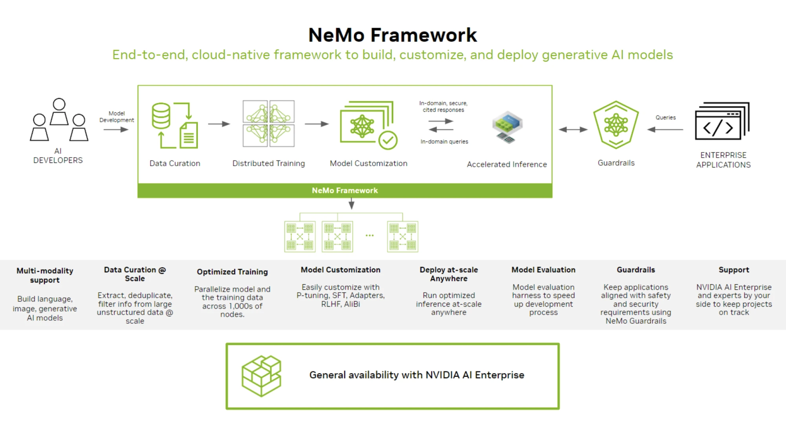

[NVIDIA NeMo™](https://docs.nvidia.com/nemo-framework/index.html)

NVIDIA NeMo™ Framework is a development platform for building custom generative AI models. The framework supports custom models for language (LLMs), multimodal, computer vision (CV), automatic speech recognition (ASR), natural language processing (NLP), and text to speech (TTS).

### NeMo Framework

NVIDIA NeMo framework is a scalable and cloud-native generative AI framework built for researchers and developers working on Large Language Models, Multimodal, and Speech AI (Automatic Speech Recognition and Text-to-Speech). It enables users to efficiently create, customize, and deploy new generative AI models by leveraging existing code and pretrained model checkpoints.
